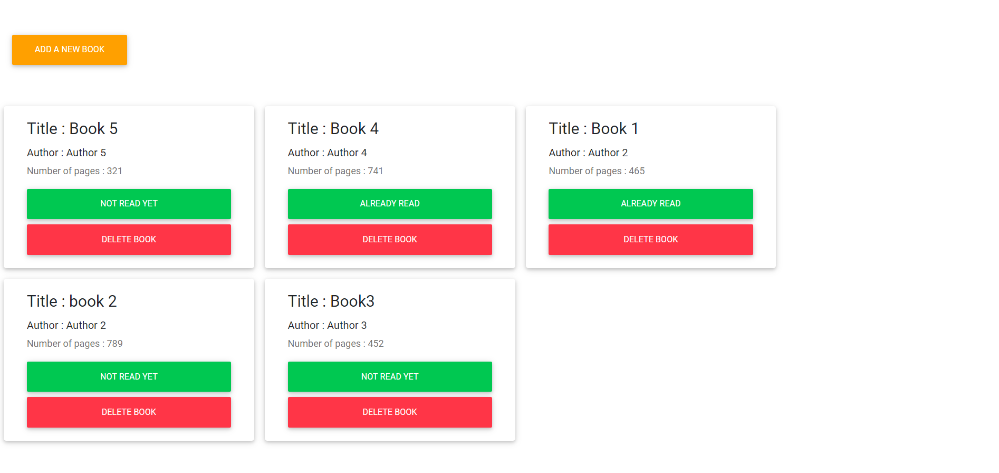

# Library


## Description

> Library web app allows you to add books with title,author, number of pages and read status. You have the possibility to remove the book added or change the read status of each book.

## Library Directory 📙

| Contents                    |
| --------------------------- |
| [Live Demo](#live-demo)     |
| [Screenshot](#screenshot)   |
| [Built With](#built-with-🛠) |
| [Authors](#authors)         |
| [License](#license)         |

## Live Demo

[Live demo](https://rawcdn.githack.com/NtwaliHeritier/js-library/a540376038707964ceb6a16b75ebce2b60a4d4cd/index.html)

## Screenshot



## Built With 🛠

```
- Javascript
- HTML/CSS
- MDBoostrap
- VS Code
```

## Authors

### 👨‍💻 Khalil Hamdi

[](https://github.com/khalilhamdii) <br>
[](https://www.linkedin.com/in/khalilhamdi/) <br>
[](mailto:khaalil.hamdi@gmail.com) <br>
[](https://twitter.com/Khalilhamdiii)

### 👨‍💻 NTWALI Heritier

[](https://github.com/NtwaliHeritier) <br>
[](https://www.linkedin.com/in/ntwaliheritier/) <br>
[](mailto:ntwalihatsor78.nh@gmail.com) <br>
[](https://twitter.com/NtwaliHeritier)

### 🤝 Contributing

Contributions, issues and feature requests are welcome!

Feel free to check the [issues page](https://github.com/NtwaliHeritier/js-library).

### Show your support

Give a ⭐️ if you like this project!

### License


